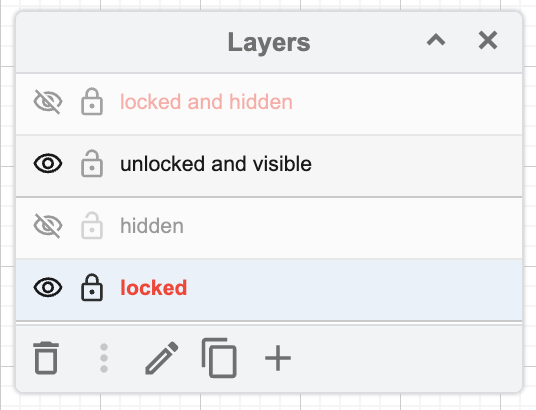

# Component Decomposition

## Philosophy

Each screen c an be decomposed into smaller components. Then those components may be able to decomposed into smaller components still. This procss can be repeated until the components are small enough to be testable and composable. When decomposing a component, you should aske the following questions:

- Can this component be decomposed into a smaller component?
- What imputs/outputs/dependency injection is needed for this component to function
- what properties will this component have?
- what methods will this component have
- Is this component testable

These questions will assist in the design of each component

## Drawio

Draw.io/Diagrams.net is a diagram tool that can be addopted to do some design work for software and application development.

### Installation

Draw.io allows single user installation. This is useful when you do not have admin access to a system. Navitate to <https://github.com/jgraph/drawio-desktop/releases/> then select `draw.io-<version>.msi`

> Note: If you are not able to update Draw.io from within the application, you can return to the github location above and download the latest `.msi file` to install the latest version.

### VsCode Extensions

Here are some extensinos that can be useful for design tasks.

<!-- TODO: Expand this list -->

- Draw.io Intigration
- SVG
- Mermaid

Extensions can be installed from the command line

```bash
# bash/Gitbash
code --install <extension-1> <extension-2>

# Example:
code --install hediet.vscode-drawio jock.svg
```

or you can intall an ectension manually by using a extension's id in the search feild for vscode:

```bash
@id:Hediet.vscode-drawio @id:jock.svg
```

### Naming

For large designs, you may wish to create a direcotry such as a Jira key, to keep all the design files together.

> **Example:**
> A design for a jira story JIRA-8888 is needed.  
> Create a directory with the path `epica/JIRA-8888`.
> Then within this directory create file with the name `JIRA-888.drawio.svg` > _using the extension `.png` allows for easy embeding into documents and web_

### Layers

Drawio offers the ability to use layers while creating diagrams. It is recommended to use layers to organize your designs to groups of related parts fo a design together. When using layers, you can lock and hide all elements located on a layer. Layers can also be used to organize different actions so you can choose to show or hide the different actions and interactions.

<!-- TODO: Screenshot for layers
* locked an hidden
* unlocked and visible
* hidden
* locked
 -->



### Icons

Icons for the Material Design icons library can be used in designing with drawio. To assist im maintaining consistancy between design and application implementation, using the same icons in each process should help with design and implementation being parady. The npm library `@mdi/svg` is an example of a library that can be used for design which can also be used for development.

To get started with using a library like `@mdi/svg` you can use npm to install it to your repository

```bash
npm install @mdi/svg
```

Once you have the npm package installed, you can copy them and optimize them for use with drawio.

#### Copying Icons

```bash
ICON=<icon-name> && cp node_modules/\@mdi/svg/svg/$ICON.svg <destination-path>

# Example
ICON=account-circle && cp node_modules/\@mdi/svg/svg/$ICON.svg drawio/icons
```

#### Optomize Icons

Since drawio is not a design tool, there are a few steps to optimize an svg file to enable drawio to modify the stroke and fill. You can add the following snipit to the top of an svg file between the root tag and the first `<path>` tag

```svg
  <!-- editableCssRules=.*; -->
  <style>
    .icon {
      fill: #000000;
      stroke: none:
    }
  </style>
  <path class="icon"...
```

```svg
## Before optimization
<svg xmlns="http://www.w3.org/2000/svg" id="mdi-delta" viewBox="0 0 24 24">
  <path d="M12,7.77L18.39,18H5.61L12,7.77M12,4L2,20H22" />
</svg>

## After optimization
<svg xmlns="http://www.w3.org/2000/svg" id="mdi-delta" viewBox="0 0 24 24">
  <!-- editableCssRules=.*; -->
  <style>
    .icon {
      fill: #000000;
      stroke: none:
    }
  </style>
  <path class="icon" d="M12,7.77L18.39,18H5.61L12,7.77M12,4L2,20H22" />
</svg>

```

Then import the file into drawio by selecting from the menu `Arrange > Insert > Image...`

Next, Select the image/svg imported and edit the style by selecting rom the menu `Edit > Edit Style...`. Then prefix the string in the edit styles dialog with `editableCssRules=.*;` and select the `Apply` button.


> Source:
> <https://www.drawio.com/doc/faq/svg-edit-colours>

### Libraries

Draw.io allows user to create libraries of reusable components. There are several libraries include with drawio. To open a library in drawio, select `File > Open Library...` from the menu.
